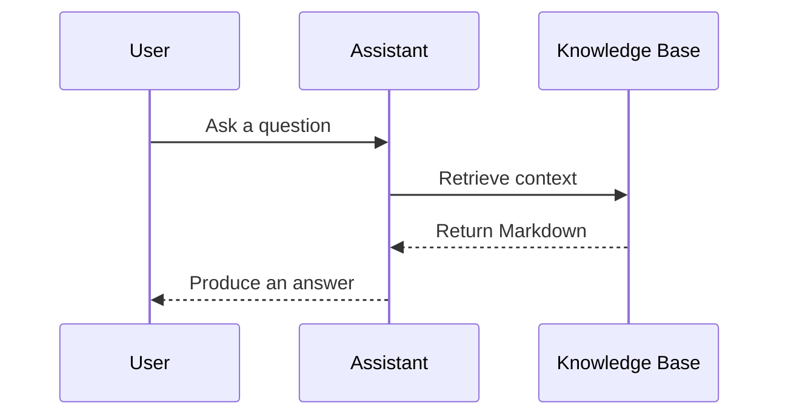

# VMDE for VS Code

**Write like it is a document. Keep it as Markdown.**

VMDE turns a `.md` file into a focused, formatted editing surface inside VS
Code. Write in WYSIWYG, reveal the Markdown around your cursor, work with source
and preview side by side, or simply read the finished document. Every view stays
connected to the same plain-text file on disk.

You get the comfort of a document editor without moving your work into another
app or another file format.


<!-- brand-check: fork-history-start -->

## From vMarkd to VMDE

VMDE began as a fork of
[vMarkd](https://github.com/spiochacz/vmarkd-visual-markdown-editor). It retains the same
Vditor-and-Lute foundation and the upstream copyright notice, but it is now developed,
published, versioned, and supported independently by Laicasaane. Issues and release guidance for
VMDE belong in this repository; changes are not presented as upstream vMarkd releases.

### How VMDE diverges

- **A clean extension identity.** VMDE installs as `Laicasaane.vmde` and uses `vmde.*` settings,
  commands, state, and editor identifiers. It does not replace, upgrade, or read configuration from
  the upstream extension automatically.
- **A broader document workflow.** VMDE adds Markdown-aware rewrapping and opt-in auto-wrap,
  section hoisting, viewport-aware outline sections, Git change bars, wiki navigation, and
  accessibility-focused keyboard flows across IR, WYSIWYG, Split, and Preview.
- **Offline-first technical rendering.** VMDE maintains its own pinned Mermaid, D2, PlantUML,
  ECharts, Vega, map, music, chemistry, math, and 3D renderer stack, including coordinated themes
  and a persistent render cache.
- **Large-document and repository focus.** Incremental serialization, progressive Split-mode
  streaming, content visibility, source reveal, workspace-aware links, and exact host writeback are
  maintained as first-class behaviors.
- **Independent security and compatibility policy.** VMDE audits the npm and vendored dependency
  trees, ships explicit provenance and license records, hardens the VS Code webview boundary, and
  tests releases in Chromium and the real VS Code custom-editor pipeline.

The projects may continue to share ideas through their common ancestry, but compatibility and
feature parity are not assumed in either direction.

<!-- brand-check: fork-history-end -->

## Markdown stays the source of truth

Visual editing is most useful when it does not take ownership of your content.
With VMDE, the document remains ordinary Markdown: portable, searchable,
version-controlled, and readable by the rest of your toolchain.

Open the visual editor only when you want it. Jump to the corresponding source
line when exact syntax matters, open source beside the formatted document, and
return to VS Code's text editor with one command. VMDE does not replace the
Markdown workflow you already have; it gives that workflow a better writing
surface.

## One editor, different kinds of work

### Write documents instead of punctuation

For notes, guides, project plans, READMEs, and long-form documentation, raw
markers can interrupt the thought you are trying to capture. VMDE keeps
headings, lists, tables, links, images, callouts, and code visually legible while
you edit them. An outline, document search, word count, and reading-time estimate
help you stay oriented as the file grows.

The result is still a `.md` file that works on GitHub, in a static-site pipeline,
or anywhere else Markdown is expected.

### Make AI-authored Markdown easier to review

Prompts, agent instructions, context files, generated reports, and AI-assisted
documentation are often Markdown too. VMDE makes those files easier for a
person to read and refine without changing the format that assistants and
automation consume.

Review generated structure as a document, inspect exact syntax in source or
split view, and use Git change bars to see what changed. There is no proprietary
document model between you and the assistant: the shared contract remains plain
text. VMDE is not an AI generator; it is a practical editing layer for the
Markdown that AI workflows already produce and depend on.

### Keep architecture close to the explanation

Technical documents rarely contain prose alone. VMDE renders code, math,
charts, maps, and diagram languages directly in the editor, so an ADR, system
design, runbook, or API guide can explain both the decision and the model behind
it. Mermaid, D2, PlantUML, Graphviz, ECharts, Vega, and other engines are
available without sending the document to an external editor.

Because diagrams remain fenced text, they are reviewable in Git, editable by
people or assistants, and versioned with the architecture they describe.
Wiki-style links and two outline views help a folder of Markdown grow into
connected project knowledge rather than a pile of isolated files.

## Why VMDE?

A source editor gives you precision. A preview gives you readability. A
standalone Markdown app can give you a polished writing surface, but takes you
away from the files, terminals, source control, and project context already open
in VS Code.

VMDE brings those strengths together:

- **Visual when you want it, source when you need it.** Choose WYSIWYG,
  instant-render, split, or preview mode per document or path.
- **No migration and no lock-in.** Your file remains Markdown on disk and stays
  in two-way sync with the editor.
- **Built for repository work.** Git change bars, source reveal, workspace-aware
  links, rename tracking, and tab-group behavior fit the VS Code workflow.
- **More than prose.** A broad, offline-first renderer set keeps diagrams, data,
  formulas, and specialist notation beside the text that explains them.
- **Opt-in by design.** VMDE never takes over all `.md` files; use it for the
  documents that benefit from a visual surface.

## Work in the view that fits the moment

- **WYSIWYG** keeps document structure visually formatted while you type.
- **Instant Rendering** shows formatted Markdown while revealing markers around
  the cursor.
- **Split** places Markdown source and live preview side by side.
- **Preview** provides a read-only rendered document and reuses a current render
  when you return to it.

Set a default mode globally, remember the last mode, or choose modes by glob —
for example, open `docs/**` in Preview and `notes/**` in IR. Very large files
load progressively; a saved Split preference opens directly into streamed source
and preview, while a saved WYSIWYG preference may use IR for that large-file session.

## Built for real Markdown work

### Edit without breaking your flow

- Responsive tables with visual editing controls, plus automatic conversion of
  pasted spreadsheet cells into Markdown tables.
- Paste a URL over selected text to create a link; paste plain text with
  `Ctrl/Cmd+Shift+V` when formatting should be discarded.
- Paste, drop, or upload files using VS Code's `markdown.copyFiles.destination`
  when the VMDE save folder is left at its default. Images can be converted to
  WebP and downscaled, WAV files keep audio markup, and other files become normal
  escaped-label Markdown links.
- Rewrap one paragraph, a selection, or every eligible paragraph in the document
  without touching structural Markdown; optional auto-wrap applies the same rules
  after a quiet typing interval.
- Fold or hoist heading sections, promote or demote a heading or complete section,
  stage structural selections, and wrap selected blocks in interactive
  `<details>/<summary>` without losing the rest of the source document.
- Add, change, title, or remove GitHub/Obsidian-style callouts from shared editing
  controls in IR, WYSIWYG, and Split.
- Configurable click behavior for links and a one-command jump to the matching
  location in the text editor.

### Navigate a document or a knowledge base

- A built-in outline panel and a Markdown Outline tree in the Explorer sidebar.
- Hoist one heading section into a focused IR/WYSIWYG view, then return through
  its `Doc › …` breadcrumb without changing the complete file on disk.
- Wiki-style `[[links]]` with completion, navigation, ambiguity handling, and
  one-click creation of missing pages.
- Document search with `Ctrl/Cmd+F`, heading highlights, and optional heading-level
  markers.
- Live word count, estimated reading time, current mode, and large-file status.

### Feel at home in VS Code

- The default theme follows VS Code and updates live. Fixed GitHub Light/Dark,
  Material Dark, and VS Code Light/Dark 2026 content themes are also available.
- VS Code high-contrast themes and browser forced-colors mode use explicit
  contrast borders, stronger focus indicators, and a shared high-contrast diagram
  palette. Reduced-motion disables scripted and CSS motion while preserving state.
- Code highlighting follows the content theme or uses any of 73 highlight.js
  styles. Line numbers are optional.
- Mermaid, D2, and ECharts have their own coordinated palettes; diagrams update
  when the active theme changes.
- Custom inline CSS and external stylesheets with live reload let a workspace
  define its own reading experience.
- Settings apply live and can be scoped per folder in a multi-root workspace.

### Stay responsive and private

- An instant read-only paint makes content visible while the live editor starts.
- Large documents use incremental updates, off-screen rendering optimizations,
  and progressive loading to remain responsive.
- The editor runs in a hardened, sandboxed webview. Remote images are disabled by
  default so opening a document does not silently disclose your IP to image
  hosts.

### Accessibility

- Press Escape, then Tab to leave the document for the roving toolbar; arrow keys
  move among toolbar controls, and Escape returns to the saved caret.
- Editor surfaces expose named multiline textbox semantics. Link-like chips,
  callout controls, outline items, tables, diagrams, and viewport controls carry
  accessible roles and names, while one polite status region announces saves,
  copies, mode changes, and renderer errors.
- Move the caret into a link, wiki link, code reference, or callout and press
  `Ctrl/Cmd+Enter` to activate it without inserting a tab stop into prose.
- The in-editor outline and its resize separator are keyboard-operable once
  focused. An end-to-end keyboard-only route from the toolbar into that outline,
  and ECharts mindmap keyboard reset, remain known limitations.

## Diagrams, data, math, and more

VMDE recognizes 18 rendered fenced-code formats. The rendering engines and
their core assets are bundled for an offline-first workflow; optional remote
images and map tiles remain behind the remote-content setting.

| What you are documenting | Fenced-code language | Useful for |
| --- | --- | --- |
| Architecture and software models | `mermaid`, `d2`, `plantuml`, `graphviz`, `flowchart`, `nomnoml` | Flow, sequence, class, state, ER, C4, deployment, and component diagrams |
| Data and geography | `echarts`, `vega`, `vega-lite`, `geojson`, `topojson` | Charts, dashboards, declarative visualizations, and maps |
| Knowledge and specialist notation | `mindmap`, `markmap`, `wavedrom`, `abc`, `smiles`, `stl`, `math` | Mind maps, timing diagrams, music, chemistry, 3D models, and KaTeX formulas |

Mermaid also covers planning-friendly formats such as Gantt charts, timelines,
static kanban boards, user journeys, quadrant charts, pie charts, and Sankey
diagrams. D2 supports multiple layout engines, coordinated themes, and an
optional hand-drawn style, including Markdown inside diagram labels. PlantUML
runs locally through its bundled TeaVM engine. Rendering errors appear beside
the source instead of silently producing a blank block.

For example, this remains ordinary, diff-friendly Markdown:

````markdown
## Request flow


````

See the [changelog](./CHANGELOG.md) for the full history of features and fixes.

## Get started

### Install

1. Open the Extensions view in VS Code (`Ctrl/Cmd+Shift+X`).
2. Search for **VMDE**.
3. Select **Install**.

From a terminal with the VS Code CLI available, you can also run:

```bash
code --install-extension Laicasaane.vmde
```

### Open a Markdown file

- In the Explorer, right-click a `.md` or `.markdown` file and choose
  **Open with VMDE**.
- From an open Markdown tab, choose **Open With… → VMDE**.
- Use **Open with VMDE to the side** when you want the visual document beside
  another editor group.

VMDE is an optional custom editor, so installing it does not change the default
editor for every Markdown file.

### Return to source

- Choose **Edit in Text Editor** or **Open source to the side** from the editor
  toolbar.
- Run **VMDE: Edit in Text Editor** from the Command Palette.
- Press `Ctrl+Alt+E` on Windows/Linux or `Cmd+Ctrl+E` on macOS.
- Switch to **Source** from the mode control in the bottom status bar.

### Handy shortcuts

| Action | Windows / Linux | macOS |
| --- | --- | --- |
| Find in document | `Ctrl+F` | `Cmd+F` |
| Paste as plain text | `Ctrl+Shift+V` | `Cmd+Shift+V` |
| Activate the link or callout at the caret | `Ctrl+Enter` | `Cmd+Enter` |
| Return to the text editor | `Ctrl+Alt+E` | `Cmd+Ctrl+E` |
| Bold / italic | `Ctrl+B` / `Ctrl+I` | `Cmd+B` / `Cmd+I` |

Formatting commands for headings, lists, checklists, quotes, code blocks, and
inline code are also available from the toolbar and VS Code keybindings.

## Requirements and workspace support

- Desktop VS Code **1.110 or newer**.
- Local, untitled, and virtual `.md` / `.markdown` documents can be edited.
- In untrusted workspaces, editing remains available, but VMDE waits for trust
  before writing uploaded images or creating wiki pages.
- In virtual workspaces, features that require a local filesystem — including
  image upload, wiki-page creation, and local asset resolution — are unavailable.

## Configuration

Open VS Code Settings and search for **VMDE**. Settings cover editing modes,
themes, diagram layouts and palettes, outlines, image handling, wiki roots,
custom CSS, and large-document performance. Most document-facing settings are
resource-scoped, so different folders can use different workflows.


## Security and remote content

Markdown can reference content on the network. VMDE blocks remote images by
default because fetching them can reveal your IP address and the fact that you
opened a file. Enable **VMDE › Image: Allow Remote** only for documents and
workspaces you trust. GeoJSON and TopoJSON can render without a basemap; remote
basemap tiles use the same permission.

Core editor and renderer assets are loaded locally inside VS Code's sandboxed
webview.

## Project

- Read the [changelog](./CHANGELOG.md) for release details.
- Report a bug or suggest an improvement in
  [GitHub Issues](https://github.com/laicasaane/vmde/issues).
- VMDE is open source under the MIT license.

## Acknowledgements

Every library whose bytes ship inside the extension carries its license text next to its code, under
`media/vditor/dist/` — one file per library, beside the bundle it covers.

**Foundation**

- [Vditor](https://github.com/Vanessa219/vditor) (MIT) — the Markdown editor component
- [Lute](https://github.com/88250/lute) (Mulan PSL v2) — the Markdown engine (vendored and pinned)

**Shipped with the Vditor package**

- [highlight.js](https://github.com/highlightjs/highlight.js) (BSD-3-Clause) — code highlighting
- [KaTeX](https://github.com/KaTeX/KaTeX) (MIT) — math typesetting
- [flowchart.js](https://github.com/adrai/flowchart.js) (MIT) — ` ```flowchart ` diagrams
- [plantuml-encoder](https://github.com/markushedvall/plantuml-encoder) (MIT) — PlantUML source encoding

**Renderers vendored and pinned by VMDE** — each one is loaded from disk, so every diagram renders offline

- [Mermaid](https://github.com/mermaid-js/mermaid) (MIT) and [@mermaid-js/layout-elk](https://github.com/mermaid-js/mermaid) (MIT) — flowcharts, sequence, class, state, ER, and the optional ELK layout
- [PlantUML](https://github.com/plantuml/plantuml) — the offline engine is PlantUML's own JavaScript (TeaVM) build, MIT-licensed ([plantuml/plantuml-mit](https://github.com/plantuml/plantuml-mit)), with the icon libraries below
- [D2](https://github.com/terrastruct/d2) by Terrastruct (MPL-2.0) — compiled to WebAssembly, with the [Go](https://github.com/golang/go) runtime shim (BSD-3-Clause)
- [elkjs / Eclipse Layout Kernel](https://github.com/kieler/elkjs) (EPL-2.0) — the layout engine shared by D2 and Mermaid's ELK mode
- [Graphviz / Viz.js](https://github.com/mdaines/viz.js) (MIT) — DOT diagrams, and PlantUML's layout backend
- [ECharts](https://github.com/apache/echarts) (Apache-2.0) — charts and mindmaps
- [Vega and Vega-Lite](https://github.com/vega/vega) (BSD-3-Clause, UW Interactive Data Lab) — grammar-of-graphics charts
- [markmap](https://github.com/markmap/markmap) (MIT) — mindmaps from Markdown outlines
- [nomnoml](https://github.com/skanaar/nomnoml) (MIT) — UML sketches
- [WaveDrom](https://github.com/wavedrom/wavedrom) (MIT) — digital timing diagrams
- [Leaflet](https://github.com/Leaflet/Leaflet) (BSD-2-Clause) and [topojson-client](https://github.com/topojson/topojson-client) (ISC) — GeoJSON / TopoJSON maps
- [three.js](https://github.com/mrdoob/three.js) (MIT) — STL 3D models
- [abc.js](https://github.com/paulrosen/abcjs) (MIT) — music notation
- [smiles-drawer](https://github.com/reymond-group/smilesDrawer) (MIT) — chemical structures
- [Rough.js](https://github.com/rough-stuff/rough) (MIT) and [dagre](https://github.com/dagrejs/dagre) (MIT) — the D2 sketch look and graph layout, bundled into the webview build

**PlantUML icon libraries** (loaded on demand, only for a diagram that includes them)

- [C4-PlantUML](https://github.com/plantuml-stdlib/C4-PlantUML) (MIT) and [Azure-PlantUML](https://github.com/plantuml-stdlib/Azure-PlantUML) (MIT) by Ricardo Niepel and contributors
- [aws-icons-for-plantuml](https://github.com/awslabs/aws-icons-for-plantuml) by AWS — macros MIT, icon assets CC BY-ND 2.0
- From [plantuml/plantuml-stdlib](https://github.com/plantuml/plantuml-stdlib): `k8s` (MIT, Diego Casati), `kubernetes` (Apache-2.0), `eip` (MIT, Andreas Heil), `edgy` (MIT), `DomainStory` (MIT, Johannes Thorn), `cloudogu` (MIT, Cloudogu GmbH), `cloudinsight` (MIT), and the [Pictogrammers](https://pictogrammers.com/) Material icons (Pictogrammers Free License)

**Fonts, themes and map tiles**

- [Source Sans 3](https://github.com/adobe-fonts/source-sans) by Adobe (SIL Open Font License 1.1) — bundled so D2 labels are measured and drawn in the same font the `d2` binary uses; the license ships as `media/fonts/OFL.txt`
- Map tiles from [OpenStreetMap](https://www.openstreetmap.org/copyright) contributors and [CARTO](https://carto.com/attributions), used only when remote images are enabled, with their attribution shown on the map
- [github-markdown-css](https://github.com/sindresorhus/github-markdown-css) by Sindre Sorhus (MIT) — the GitHub light/dark markdown-rendering themes (`vmde.theme.content`), vendored under `media/markdown-themes/` (upstream verbatim, plus a small marked override block re-asserting the inline-code background on the editor surface)
- [vscode-markdown-style](https://github.com/raycon/vscode-markdown-style) by raycon (MIT) — the Material Dark (One Dark) rendering theme (`vmde.theme.content`), adapted under `media/markdown-themes/`
- [Beautiful Mermaid](https://github.com/lukilabs/beautiful-mermaid) by Craft Docs (MIT) — the 15 Mermaid diagram palettes (`vmde.diagram.mermaid.theme`); only the colour values are vendored (in `src/mermaid-palettes.ts`, translated to mermaid `themeVariables`), not the renderer
- [microsoft/vscode](https://github.com/microsoft/vscode) (MIT) — the `vscode-light-2026` / `vscode-dark-2026` rendering themes use the built-in **Light 2026 / Dark 2026** palettes (the VS Code 1.123+ defaults — [`extensions/theme-defaults/themes`](https://github.com/microsoft/vscode/tree/main/extensions/theme-defaults/themes)) + the markdown preview layout ([`extensions/markdown-language-features/media/markdown.css`](https://github.com/microsoft/vscode/blob/main/extensions/markdown-language-features/media/markdown.css))

## License

MIT
